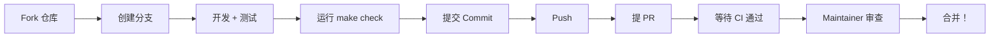

# 贡献指南（Contributing Guide）

感谢你对 **Claude Code Fusion**（和谐架构）感兴趣！本文档说明如何提交代码、报告 Bug 和提出新功能。

---

## 📋 目录

- [行为准则](#行为准则)
- [快速开始](#快速开始)
- [如何贡献](#如何贡献)
- [代码规范](#代码规范)
- [提交规范](#提交规范)
- [发布流程](#发布流程)

---

## 行为准则

这个项目采用 **[Contributor Covenant]**（贡献者公约）作为我们的行为准则。

**简短版**：

- ✅ 尊重他人、耐心倾听
- ✅ 接受建设性批评
- ✅ 聚焦对项目有益的事情

**简短英文版**：

- Be kind, be patient
- Accept constructive criticism
- Focus on what is best for the community

---

## 快速开始

### 1. Fork 仓库

```bash
# 在 GitHub 上点击右上角 "Fork"
# 然后克隆到你的本地

git clone https://github.com/YOUR_USERNAME/hermes-claude-code-fusion.git
cd hermes-claude-code-fusion
```

### 2. 设置开发环境

```bash
# 创建虚拟环境
python -m venv venv
source venv/bin/activate  # Windows: venv\Scripts\activate

# 安装开发依赖（包含测试、lint 工具）
pip install -e ".[dev]"

# 验证安装
make test      # 运行测试
make lint      # 代码检查
make check     # 两者都跑
```

### 3. 创建功能分支

```bash
git checkout -b feat/my-feature  # 新功能
# 或
git checkout -b fix/bug-123      # 修复 bug
```

---

## 如何贡献

### 报告 Bug

**步骤**：

1. 在 [Issues](https://github.com/walle-wangzan/hermes-claude-code-fusion/issues) 检查是否已存在相同问题
2. 如果没有，创建新 Issue：

```
标题：[Bug] 简短描述（例如：FileEditTool error_code 6 误触发）

环境：
- Python: 3.11
- 操作系统：macOS 14.0
- 版本：v0.1.0（或 latest）

复现步骤：
1. 运行 `Run tool` 命令
2. 尝试 `Edit file.py`
3. 没有先 `Read file.py`

预期行为：
- 应该返回 error_code 4 而不是 6

实际行为：
- 返回了 error_code 6（未读取）
- 错误信息：...
```

### 提出新功能（Feature Request）

```
标题：[Feature] 简短描述（例如：添加 Docker 支持）

问题描述：
- 当前手动安装依赖很麻烦
- 无法跨平台

建议的解决方案：
- 添加 Dockerfile（基于 Python 3.12-slim）
- 添加 Docker Compose 配置（可选）

替代方案（考虑过但不采用）：
- 使用 conda（较重）
- 使用 pipenv（不标准）
```

### 提交 Pull Request

**流程**：



**关键步骤**：

1. **拉取最新代码**（避免冲突）
   ```bash
   git fetch upstream
   git rebase upstream/main
   ```

2. **运行检查**（确保 PR 不会失败）
   ```bash
   make check  # 运行 all tests + lint
   ```

3. **提交代码**（语义化提交）
   ```bash
   git commit -m "feat: 添加 Dockerfile 支持
   
   - 新增 Dockerfile (python:3.12-slim)
   - 新增 .dockerignore
   - 文档说明：docker run -it claude-harmony
   
   Closes #123"
   ```

4. **推送到 GitHub**
   ```bash
   git push origin feat/my-feature
   ```

5. **创建 PR**
   - 前往 Fork 的 GitHub 页面
   - 点击 "Pull requests" → "New pull request"
   - 填写 PR 模板

---

## 代码规范

### Python 风格

**使用 Ruff（超快）**：

```bash
# 自动格式化
make format      # black + isort
make lint        # ruff check
```

**手动检查**：

```bash
ruff check claude_core.py
black --check *.py
```

**关键规则**：

- **PEP 8**：最大行宽 120（不是 79，因为我们有注释）
- **类型提示**：所有公共函数必须有类型注解
- **文档字符串**：所有函数必须有 docstring（类似 Claude Code 代码评论风格）

### 测试要求

**新代码必须包含测试**：

```python
# tests/test_new_feature.py
import unittest
from claude_core import MyNewClass

class TestMyNewClass(unittest.TestCase):
    def test_happy_path(self):
        """正常用例"""
        result = MyNewClass.run()
        self.assertEqual(result, expected_value)
        
    def test_edge_case(self):
        """边界用例（例如：空字符串、超大文件）"""
        pass
```

**运行测试**：

```bash
make test           # 所有测试 + 覆盖率
pytest tests/ -v    # 详细输出
pytest tests/test_xxx.py -x  # 单个测试，失败即停
```

### Docker 规范

- **镜像大小**：目标 <500MB（使用 slim 镜像）
- **安全**：非 root 用户（appuser）
- **端口**：不暴露端口（无状态，CLI 工具）

---

## 提交规范

我们使用 **[Commitizen]** 风格的约定。

**格式**：

```
<type>(<scope>): <subject>
<BLANK LINE>
<body>
<BLANK LINE>
<footer>
```

**类型（type）**：

| 类型 | 描述 | 示例 |
|------|------|------|
| **feat** | 新功能 | `feat: 添加 Dockerfile 支持` |
| **fix** | Bug 修复 | `fix: error_code 6 误判问题` |
| **docs** | 文档更新 | `docs: 更新 README.md` |
| **style** | 格式调整 | `style: 使用 black 格式化` |
| **refactor** | 重构 | `refactor: 重构 FileStateCache` |
| **perf** | 性能优化 | `perf: 模糊匹配算法优化` |
| **test** | 测试相关 | `test: 添加单元测试` |
| **chore** | 构建/工具 | `chore: 更新 pyproject.toml` |

**示例**：

```bash
feat: 添加模糊引号匹配支持

在 FStringMatcher 中添加 curly quote → straight quote 转换。
解决用户在编辑器中使用弯引号导致匹配失败的问题。

Closes #45

测试：tests/test_extreme.py::TestStringMatcher
```

---

## 发布流程

### 版本命名

我们使用 **[SemVer]**（语义化版本）：`MAJOR.MINOR.PATCH`

- **MAJOR**：不兼容的 API 变更
- **MINOR**：向后兼容的新功能  
- **PATCH**：向后兼容的 Bug 修复

### 发布步骤

1. **创建 Release 分支**
   ```bash
   git checkout -b release/v0.2.0
   ```

2. **更新版本**
   ```bash
   # pyproject.toml
   version = "0.2.0"
   ```

3. **创建 Tag**
   ```bash
   git tag -a v0.2.0 -m "Release v0.2.0: [描述]"
   git push origin v0.2.0
   ```

4. **创建 GitHub Release**
   - 使用 GitHub API 或网页
   - 生成 Release Notes

---

## 成为审核者（Reviewer）

贡献达到一定数量后，可以申请代码审核权：

**要求**：
- 至少 2 个已合并的 PR（非 typo）
- 熟悉项目架构
- 愿意参与社区讨论

---

## 提问

有疑问？欢迎：

- **打开 Issue**（讨论类）
- **创建 Discussion**（技术讨论）
- 直接联系作者：`walle-wangzan`

---

## 致谢

感谢所有贡献者！🙏

<!-- Links -->
[Contributor Covenant]: https://www.contributor-covenant.org/
[Commitizen]: https://commitizen-tools.github.io/
[SemVer]: https://semver.org/
